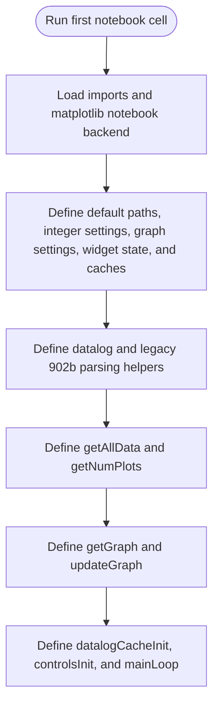
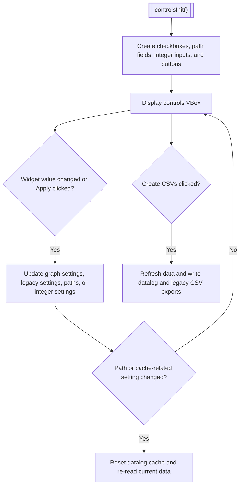

# cbmark_logger

`cbmark_logger` parses cathode benchmarking experiment logs from the EBeam dashboard and Tera Term sources, then turns them into combined monitoring graphs and optional CSV exports. The main way to use this repo is to run [`Generate_combined_graph.ipynb`](Generate_combined_graph.ipynb) in VS Code.

## Setup

If you already have a set up environment, you can skip to the workflows section

### Create a venv for Python and import dependencies for CBMARK_LOGGER

Create and activate a project virtual environment before running any notebook:

```powershell
git clone https://github.com/uw-loci/cbmark_logger.git
cd cbmark_logger
python -m venv .venv
.\.venv\Scripts\activate
pip install -r requirements.txt
code .
```

### Set up VSCode

1. Install the following extensions (ctrl+shift+x or click the button on the left) :
    - Jupyter
    - Python
2. Open VSCode to the CBMARK_LOGGER folder
3. Select the venv as the Jupyter kernel
    - Click on the kernel button in the top left of the editor window
    - Select the ".venv (Python [version here])" option

## What This Repo Does

- Reads experiment logs from the EBeam dashboard and Tera Term logs.
- Combines available signals into one monitoring view, including PMON temperatures, CCS temperatures, pressure readings, HV readings, and CCS PSU data.
- Supports both live-style monitoring from the latest log files and offline analysis from specific saved files.
- Can export parsed data to CSV files for later inspection.
- Includes secondary notebooks for interactive graph inspection and PMON hardware logging.

## Recommended Workflow: live-graph.ipynb

Use [`live-graph.ipynb`](live-graph.ipynb) for normal day-to-day viewing of experiment data.

1. Open `live-graph.ipynb` in VS Code and confirm the selected kernel is `.venv` (top right).
2. Run the code cell (the top cell), then scroll to the controls cell near the bottom of the notebook.
    - You can hover over a cell and press the play button with an up arrow to run all above cells
    - You may wish to minimize the code cells by double-clicking their left edge
3. Ensure the displayed file paths are correct. If they are not, click on the file path you want to change and edit it, making sure to use forward slashes.
    - If you want to use the most recent file, make sure that the provided path goes to a folder and has /* at the end.
    - If you want to use a specific file, simply enter the path to that file.
4. Select the number of previous datalog files to read
    - This reads the rotated log files from before the most recent one
5. Edit the enabled subplots if the defaults are not to your liking. At least two enabled data sources must contain data or the graph function will refuse to draw.
6. Adjust `figureWidth` and `figureHeight` if the graph does not fit your display well.
7. Run the bottom graph cell.
   The notebook will parse the selected logs and render a multi-panel matplotlib graph in the notebook output.
8. To change settings:
    - Interrupt the graphing loop by pressing the stop button on the bottommost cell
    - Change any settings you need in the settings panel
    - Click the green "Apply settings" button
    - Run the graphing cell again (bottommost cell)
9. Stop the live-refresh loop by interrupting the running cell or notebook kernel when you are done. You can also do this to generate a static graph.
    - The kernel will sometimes take multiple attemps to stop.
    - It is preferable to not restart the kernel and instead try again so your settings are saved.
10. To generate CSV files:
    - Stop the live-refresh loop
    - Press the blue "Generate CSVs from read data" button
    - CSV files will show up in the CSV files folder

## Inputs and Outputs

Inputs used by the combined graph notebook:

- Tera Term HV monitor logs for the 902b pressure transducer
- Datalog files for all other data sources
- Optional sample files from `Data samples` when you want to test without live log folders.

Outputs produced by this repo:

- A live or one-time combined graph rendered inside the notebook output.
- Optional CSV exports from the CSV generation button in [`live-graph.ipynb`](live-graph.ipynb).
- CSV files written to the `CSV files` folder.

Notes on generated CSV files:

- The `CSV files` folder is the normal working output location for generated CSVs.
- Files in `CSV files` are not automatically treated as archived, version-controlled experiment artifacts.
- CSV files will only be generated while the graph is not running

## Other Workflows

### static-interactive-graph.py

Use [`static-interactive-graph.py`](static-interactive-graph.py) when you want an alternate graph view with graph interaction

1. Open a code editor
2. Configure the file paths at the top for either saved files or the latest available logs.
3. Configure graphing options at the top of the file
4. Open a terminal
5. Set up a venv using the directions above
6. Run static-interactive-graph.py using ```python .\static-interactive-graph.py```

This notebook is useful for closer inspection, but it is not the primary monitoring path for the repo.

### Troubleshooting

- Wrong kernel or missing packages: make sure the notebook kernel is `.venv`, then run `pip install -r requirements.txt` from the activated virtual environment.
- Empty plots from wrong file paths: check whether your file paths match the files you actually have.
- Empty plots from missing data: the combined graph needs at least two enabled sources with real data. If fewer than two enabled sources are non-empty, the graph will not render.
- Notebook keeps refreshing: the bottom cell is designed to keep re-reading logs when `run` remains enabled. Interrupt the cell to stop it.
- Graph does not fit the screen well: stop the graphing cell, tune `figureWidth` and `figureHeight` in the settings panel and rerun it.
- Latest-log mode fails immediately: make sure the expected log folders contain files. The notebook uses the most recently modified file in each folder and will fail if a required folder is empty.

## Development / Logging Notes

The sections below are optional reference material for collecting logs, setting up serial logging, or debugging the experiment environment. Most users who only want to view experiment data should start with `live-graph.ipynb` instead.

### Folder structure

- CSV files (NOT version controlled)
  - Stores exported CSV format experiment data
- Example data samples (version controlled)
  - Stores data samples that can be used for testing or graph verification
- Tera Term logs (NOT version controlled)
  - Stores files generated by Tera Term during an experiment
- Tera Term Macros
  - Stores macros for initializing Tera Term

### Tera Term setup (Manual)

1. Download and install Tera Term from <https://github.com/TeraTermProject/osdn-download/releases> (default options work)
2. Open Tera Term and close the connection dialog
3. Enter the "Additional Settings" menu (press ALT, S, D or "Setup" -> "Additional Settings")
4. Switch to the "Log" tab
5. Check the "Auto start logging" and "Timestamp" options ("Append" and "Plain Text" should already be checked, you can leave it this way)
6. Change "Default log save folder" (filepath) and "Default log file name" as desired but note what you set them to so that you can enter them
7. Press "OK" in the bottom right of the "Tera Term: Additional Settings" window
8. Press the "Save Setup" button (press ALT, S, S or "Setup" -> "Save Setup") and replace TERATERM.ini
9. Create a new connection with the serial device (ALT+N or File -> New Connection, then click Serial and click on the correct COM port)
    - For an Arduino Mega, the COM port will be named Arduino Mega. This will be the case for the Knob Box Arduinos or High Voltage Monitor Arduinos.
    - Other devices, such as USB RS-485 adapters (for the 902b especially) will need to be differentiated through other means, such as by opening Device Manager and watching to see which COM port appears when the adapter is plugged in.
10. Click "OK" once COM port has been selected

### Tera Term setup (Macro)

1. Download and install Tera Term from <https://github.com/TeraTermProject/osdn-download/releases> (default options work).
2. Open Tera Term and create a new connection with the serial device (ALT+N or File -> New Connection, then click Serial and click on the correct COM port)
    - For an Arduino Mega, the COM port will be named Arduino Mega. This will be the case for the Knob Box Arduinos or High Voltage Monitor Arduinos.
    - Other devices, such as USB RS-485 adapters (for the 902b especially) will need to be differentiated through other means, such as by opening Device Manager and watching to see which COM port appears when the adapter is plugged in.
3. Open the macro file explorer (ALT, O, M or "Control" -> "Macro") and select the corresponding .ttl macro file in cbmark_logger\Tera Term Macros
    - This will start logging, set the baud rate (if not correctly set already), and may send a recurring command (like polling the 902b for pressure readings)
4. If the Tera Term macro has a recurring command, you can stop the macro by showing the macro window (ALT, O, W or "Control" -> "Show Macro Window") and pressing "End"
5. The file path in the macro will default to the corresponding Tera Term logs folder in C:\Users\Experiment\cbmark_logger\ but it may be changed if somewhere else is more convenient.

### Tests

All tests are located in this Google Doc: <https://docs.google.com/document/d/1HkbC7HqXeKXyMz-Wmsc2SCqoWQ2bClf5BJ_eqAiOwZA/edit?tab=t.0>

### `static-interactive-graph.py` Overall Flow

```mermaid
flowchart TD
    Start([Run script]) --> Config[Load imports, default paths, integer settings, graph settings, and caches]
    Config --> InitTitle

    subgraph Init[" "]
        InitTitle[["datalogCacheInit()"]]
        Reset[Reset datalog tail state and cache]
        FindPrev[Find files matching datalog path]
        PrevDecision{Previous datalog files configured and available?}
        ReadPrev["Read selected previous files with getDataFromDatalogFile()"]

        InitTitle --> Reset
        Reset --> FindPrev
        FindPrev --> PrevDecision
        PrevDecision -- Yes --> ReadPrev
    end

    PrevDecision -- No --> CurrentDataTitle
    ReadPrev --> CurrentDataTitle

    subgraph CurrentData[" "]
        CurrentDataTitle[["getAllData()"]]
        LatestDatalog[Find most recent datalog file]
        ParseDatalog["getDataFromDatalogFile()"]
        Tail["_read_appended_json_lines()"]
        JsonLines[Decode only complete newly appended JSON lines]
        Flatten[Parse JSON, flatten sensor fields, convert timestamps and numeric columns]
        Cache[Append to datalog cache, sort by time, apply optional rolling time window]
        LegacyDecision{Any legacy graph enabled?}
        Latest902b[Find most recent 902b log file]
        Parse902b["get902bPressureData()"]
        Regex[Extract timestamp and pressure with regex into legacy DataFrame]
        ReturnData[Return datalog DataFrame and legacy DataFrames]

        CurrentDataTitle --> LatestDatalog
        LatestDatalog --> ParseDatalog
        ParseDatalog --> Tail
        Tail --> JsonLines
        JsonLines --> Flatten
        Flatten --> Cache
        Cache --> LegacyDecision
        LegacyDecision -- Yes --> Latest902b
        Latest902b --> Parse902b
        Parse902b --> Regex
        Regex --> ReturnData
        LegacyDecision -- No --> ReturnData
    end

    ReturnData --> CountTitle

    subgraph CountPlots[" "]
        CountTitle[["getNumPlots()"]]
        Count[Inspect enabled graph settings and available DataFrames]
        MarkData[Mark enabled subplots that have data and count plot panels]

        CountTitle --> Count
        Count --> MarkData
    end

    MarkData --> BuildTitle

    subgraph Build[" "]
        BuildTitle[["getGraph()"]]
        EnoughPlots{At least 2 plots?}
        Stop[Print warning and stop rendering]
        Axes[Create matplotlib subplot grid]

        BuildTitle --> EnoughPlots
        EnoughPlots -- No --> Stop
        EnoughPlots -- Yes --> Axes
    end

    Axes --> RenderTitle

    subgraph Render[" "]
        RenderTitle[["updateGraph()"]]
        PlotDatalog[Plot enabled datalog graph groups with latest values in legends]
        PlotLegacy[Plot enabled legacy graph groups]
        Format[Format grids, ticks, labels, datetime x-axis, and layout]
        Show["plt.show()"]

        RenderTitle --> PlotDatalog
        PlotDatalog --> PlotLegacy
        PlotLegacy --> Format
        Format --> Show
    end

    classDef functionGroup stroke-width:1px,stroke-dasharray:5 5
    class Init,CurrentData,CountPlots,Build,Render functionGroup
    classDef functionTitle stroke-width:2px
    class InitTitle,CurrentDataTitle,CountTitle,BuildTitle,RenderTitle functionTitle
```



### `live-graph.ipynb` Overall Flow

#### Cell 1: Imports, Settings, and Function Definitions



#### Cell 2: Controls



#### Cell 3: Live Graph Loop

```mermaid
flowchart TD
    LiveCell[Start live graph cell] --> LoopInit[Set last loop time and initialize datalog cache]
    LoopInit -->  MainLoopTitle

    MainLoopTitle[["mainLoop()"]] --> TimeParse[Start parsing timer]
    TimeParse --> CurrentDataTitleLive

    subgraph CurrentDataLive[" "]
        CurrentDataTitleLive[["getAllData()"]]
        LatestDatalogLive[Find most recent datalog file]
        ParseDatalogLive["getDataFromDatalogFile()"]
        TailLive["_read_appended_json_lines()"]
        JsonLinesLive[Decode only complete newly appended JSON lines]
        FlattenLive[Parse JSON, flatten sensor fields, convert timestamps and numeric columns]
        CacheLive[Append to datalog cache, sort by time, apply optional rolling time window]
        LegacyDecisionLive{Any legacy graph enabled?}
        Latest902bLive[Find most recent 902b log file]
        Parse902bLive["get902bPressureData()"]
        RegexLive[Extract timestamp and pressure with regex into legacy DataFrame]
        ReturnDataLive[Return datalog DataFrame and legacy DataFrames]

        CurrentDataTitleLive --> LatestDatalogLive
        LatestDatalogLive --> ParseDatalogLive
        ParseDatalogLive --> TailLive
        TailLive --> JsonLinesLive
        JsonLinesLive --> FlattenLive
        FlattenLive --> CacheLive
        CacheLive --> LegacyDecisionLive
        LegacyDecisionLive -- Yes --> Latest902bLive
        Latest902bLive --> Parse902bLive
        Parse902bLive --> RegexLive
        RegexLive --> ReturnDataLive
        LegacyDecisionLive -- No --> ReturnDataLive
    end

    ReturnDataLive --> TimeGraphBuild[Start graph-generation timer]
    TimeGraphBuild --> CountTitleLive

    subgraph CountPlotsLive[" "]
        CountTitleLive[["getNumPlots()"]]
        CountLive[Inspect enabled graph settings and available DataFrames]
        MarkDataLive[Mark enabled subplots that have data and count plot panels]

        CountTitleLive --> CountLive
        CountLive --> MarkDataLive
    end

    MarkDataLive --> BuildTitleLive

    subgraph BuildLive[" "]
        BuildTitleLive[["getGraph()"]]
        EnoughPlotsLive{At least 2 plots?}
        StopLive[Print warning for too few plots]
        AxesLive[Create matplotlib subplot grid]

        BuildTitleLive --> EnoughPlotsLive
        EnoughPlotsLive -- No --> StopLive
        EnoughPlotsLive -- Yes --> AxesLive
    end

    AxesLive --> TimeRender[Start rendering timer]
    StopLive --> PrintTiming
    TimeRender --> RenderTitleLive

    subgraph RenderLive[" "]
        RenderTitleLive[["updateGraph()"]]
        PlotDatalogLive[Plot enabled datalog graph groups with latest values in legends]
        PlotLegacyLive[Plot enabled legacy graph groups]
        FormatLive[Format grids, ticks, labels, datetime x-axis, and layout]
        ShowLive["plt.show()"]

        RenderTitleLive --> PlotDatalogLive
        PlotDatalogLive --> PlotLegacyLive
        PlotLegacyLive --> FormatLive
        FormatLive --> ShowLive
    end

    ShowLive --> PrintTiming[Print generation time, parse time, graph build time, render time, and loop interval]
    PrintTiming --> Throttle{Total loop time below 0.25 seconds?}
    Throttle -- Yes --> Sleep[Sleep until minimum interval]
    Sleep --> CloseFigures[Close all matplotlib figures]
    Throttle -- No --> CloseFigures
    CloseFigures --> ReturnLoopTime[Return updated last loop time]
    ReturnLoopTime --> ClearLoop[Clear previous notebook output]
    ClearLoop --> Interrupted{Interrupted?}
    Interrupted -- No --> MainLoopTitle
    Interrupted -- Yes --> StopLoop[Stop live loop]

    subgraph InterruptFlow["Interrupt behavior"]
        direction TD
        FinalClear[Clear output one last time]
        FinalDraw[Run one final mainLoop draw]

        FinalClear --> FinalDraw
    end

    FinalDraw --> MainLoopTitle

    classDef functionGroup stroke-width:1px,stroke-dasharray:5 5
    class CurrentDataLive,CountPlotsLive,BuildLive,RenderLive,InterruptFlow functionGroup
    classDef functionTitle stroke-width:2px
    class MainLoopTitle,CurrentDataTitleLive,CountTitleLive,BuildTitleLive,RenderTitleLive functionTitle
```


